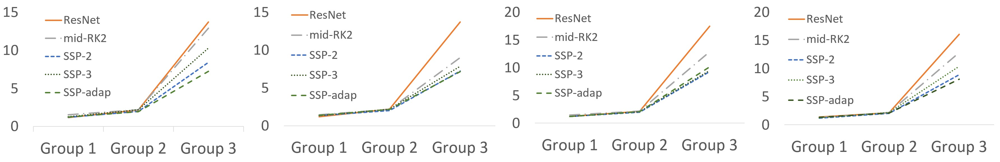
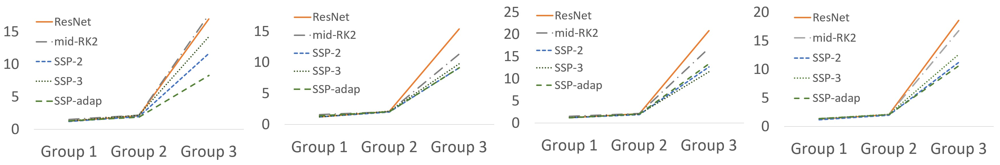

# Robust Neural Networks inspired by Strong Stability Preserving Runge-Kutta methods.
Byungjoo Kim, Bryce Chudomelka, Jinyoung Park, Jaewoo Kang, Youngjoon Hong, Hyunwoo J. Kim.



The full figures of perturbation growth ratio.

Top: PGR with L1 norm, (N,K)=(6,7), (6,12), (10,7), (10,12) with left to right.

Bottom: PGR with L2 norm, (N,K)=(6,7), (6,12), (10,7), (10,12) with left to right.

Codes for our ECCV2020 paper **Robust Neural Networks inspired by Strong Stability Preserving Runge-Kutta
methods** [[paper]](https://www.ecva.net/papers/eccv_2020/papers_ECCV/papers/123540392.pdf). All the materials in this paper is included in
[here](https://drive.google.com/drive/folders/1tEDdRrA7fQtQYH6Hcc97t96lJI-pDFih?usp=sharing).

## Abstract
Deep neural networks have achieved state-of-the-art performance in a variety of fields.
Recent works observe that a class of widely used neural networks can be viewed as the Euler method of numerical discretization.
From the numerical discretization perspective, Strong Stability Preserving (SSP) methods are more advanced techniques than the explicit Euler method
that produce both accurate and stable solutions.
Motivated by the SSP property and a generalizedRunge-Kutta method, we propose Strong Stability Preserving networks (SSP networks) which improve
robustness against adversarial attacks.
We expirically demonstratet that the proposed networks improve the robustness against adversarial examples without any defensive methods.
Further, the SSP networks are complementary with a state-of-the-art adversarial training scheme.
Lastly, our experiments show that SSP networks suppress the blow-up of adversarial perturbations.
Our results open up a way to study robust architectures of neural networks leveraging rich knowledge from numerical discretization literature.

## Installation
First, create your conda environment with python=3.6.
Then use `setup.sh` to install the requirements.
Download the pretrained models from [here](https://drive.google.com/drive/folders/1tEDdRrA7fQtQYH6Hcc97t96lJI-pDFih?usp=sharing) to the
`pretrained_models` directory.

## Adversarial training
You could change some variables including `$model`, `$block`, `$iters`, `$attack`, `$eps`, `$alpha`, etc.
If you do not change the argument, the training could be constructed with default arguments.
The available combinations are listed below.

| args | Valid arguments |
|:----:|:---------------:|
| `$model` | `res`, `ssp2`, `ssp3`, `ark`, `midrk2` |
| `$block` | Number of blocks. Any integer numbers bigger than 0 |
| `$lr` | Learning rate |
| `$decay` | Weight decay of SGD. |
| `$tbsize` | Training batchsize. |
| `$iters` | Any integer numbers bigger than 0. This argument is used for PGD adversarial training. |
| `$attack` | `none` (without adversarial training), `fgsm`, `pgd`, `ball` (training with random perturbation augmentation, used in our MNIST experiments) |
| `$epochs` | Number of epochs in training. Default is 200 |
| `$save` | Saving location of trained models. |
| `$opt` | Optimizers. `sgd` or `adam` |
| `$gpu` | Gpu allocation. If you are using multiple GPUs, you could set the argument `$multi` as `True` (only available for TinyImagenet). |
| `$norm` | Normalization layer selection. `b`(BatchNorm) and `g`(GroupNorm) is available. |
| `$seed` | Random seed. |

In our training setup, the argument `$eps` and `$alpha` are fixed. Please refer lines 15~28 of `container.py` for detailed descriptions.

For training the models on MNIST, you could use
```
python mnist_train.py --model {$model} --epochs {$epochs} --block {$block} --lr {$lr} --norm {$norm} --save {$save} --gpu {$gpu} --adv {$adv} --opt {$opt}
```
In similar way, you could use `fmnist_train.py` to train the model on FMNIST.

For CIFAR10, you could use
```
python cifar10_train.py --model {$model} --epochs {$epochs} --block {$block} --lr {$lr} --save {$save} --gpu {$gpu} --adv {$adv} --attack {$attack}
```

For TinyImagenet with multiple GPUs, you could use
```
python tinyimagenet_train.py --model {$model} --epochs {$epochs} --block {$block} --lr {$lr} --save {$save} --adv {$adv} --multi True --attack {$attack}
```
The variable we used is in our paper and supplement.


## Robustness evaluation
The additional arguments are listed below.
| args | Valid arguments |
|:----:|:---------------:|
| `$eval` | Datasets for evaluation. `mnist`, `cifar10`, `fmnist` or `tiny` |
| `$archi` | Architectures of model. When you evaluate the TinyImagenet model, you should use `imagenet`. |
| `$eps` | Maximum perturbation range. Default is `8`. When you evaluate the gray-scale image, you should use the float number between 0 to 1. |
| `$alpha` | Stepsize of adversarial attack. The range is same as `$eps` |
| `$bsize` | Batch size |

For evaluating the robustness on trained models (or pretrained models in [here](https://drive.google.com/drive/folders/1tEDdRrA7fQtQYH6Hcc97t96lJI-pDFih?usp=sharing)),
you could use
```
python attack_test.py --model {$model} --eval {$eval} --attack {$attack} --archi {$archi} --block {$block} --load pretrained_models/cifar10/6blocks_7iters/{$model} --eps {$eps} --alpha {$alpha} --iters {$iters}
```
The argument `load` should be changed if you evaluate your own model.

## Perturbation Growth analysis
The perturbation growth described in our paper (it has similar concepts with lipscitz constant, we discuss it in our supplement) could be derived from
the below commands. Note that this code is only available for CIFAR10 models.

```python lipschitz.py --load pretrained_models/cifar10/{$block}blocks_{$iters}iters/{$model} --model {$model} --block {$block} --attack pgd --eps 8. --alpha 2. --iters 20 --norm_type 1```

```python lipschitz.py --load pretrained_models/cifar10/{$block}blocks_{$iters}iters/{$model} --model {$model} --block {$block} --attack pgd --eps 8. --alpha 2. --iters 20 --norm_type 2```

## Citation
```
@inproceedings{kim2020sspnet,
  title={Robust Neural Networks inspired by Strong Stability Preserving Runge-Kutta methods},
  author={Kim, Byungjoo and Chedomelka, Bryce and Park, Jinyoung and Kang, Jaewoo and Hong, Youngjoon and Kim, Hyunwoo J},
  booktitle={ECCV},
  year={2020},
  organization={Springer}
}
```
